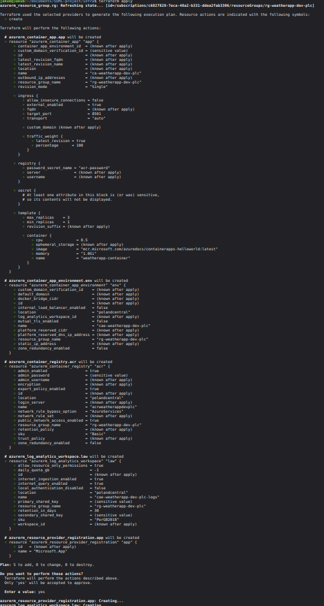
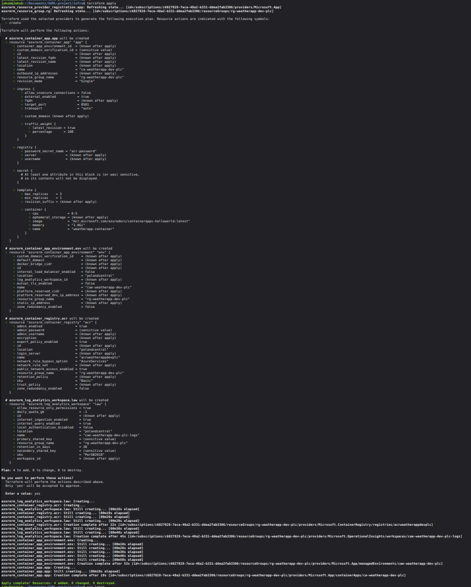
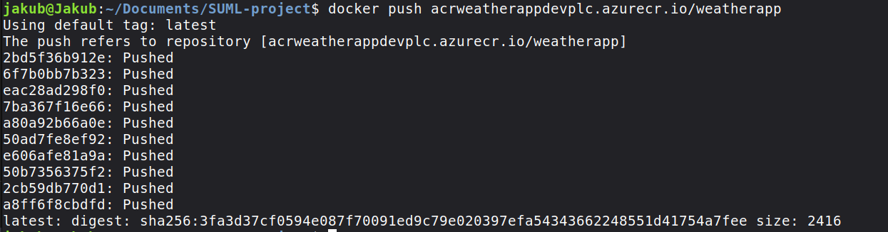
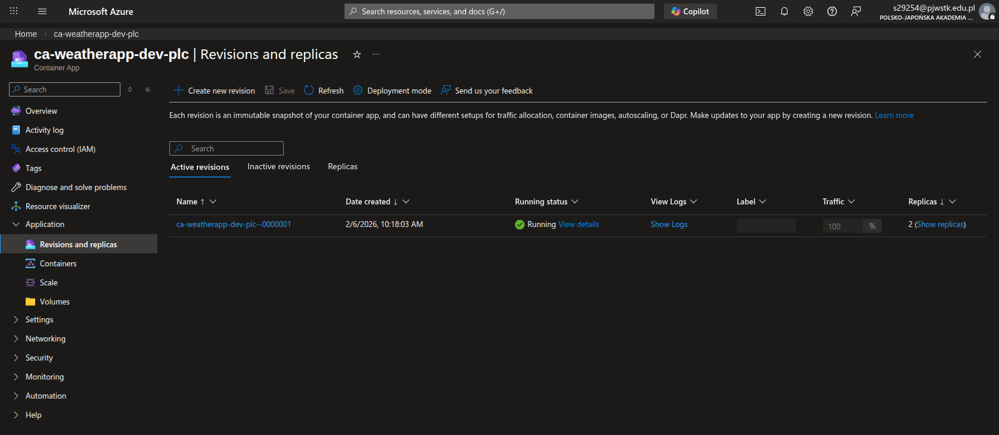
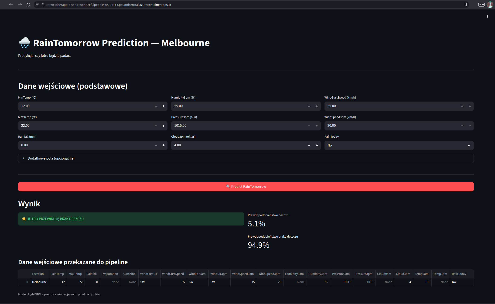

Documentation of the IaC and cloud components.

We used Terraform to provision all resources.

Terraform apply outputs:

Some issues later... 😄

After a few issues we were able to sucessfully push our image into ACR:

Final result:

And, of course, we did not forget to perform Terraform destroy at the end 🎉️
